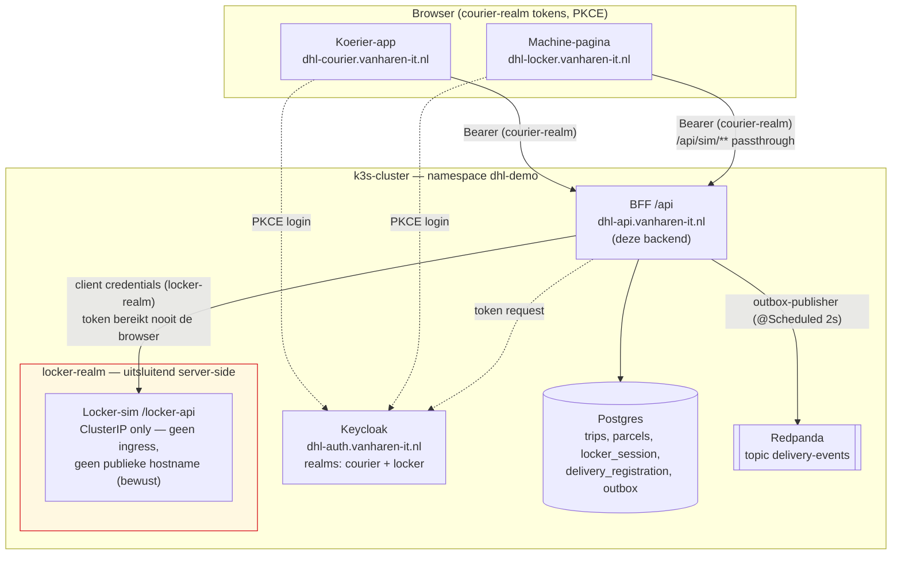
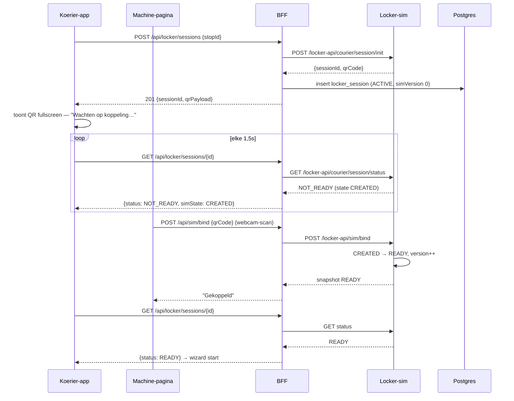
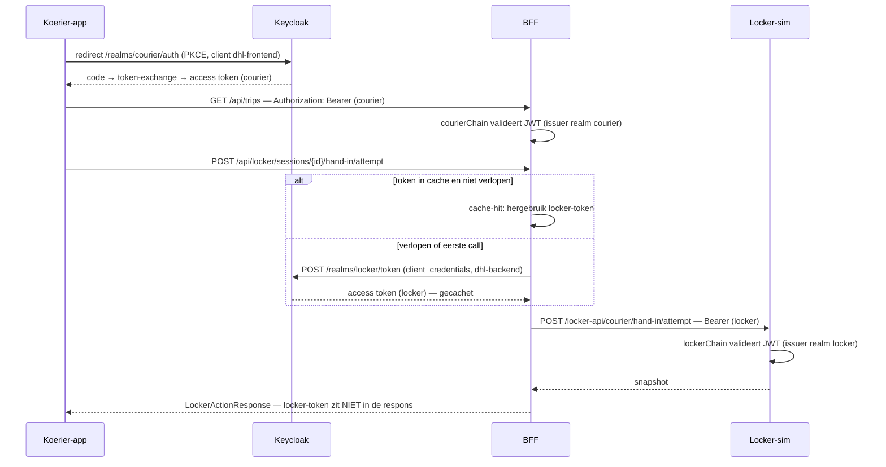
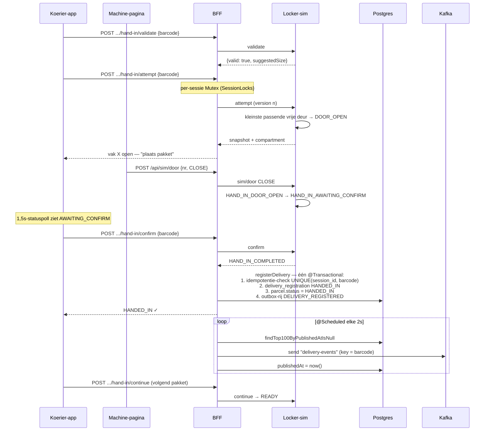
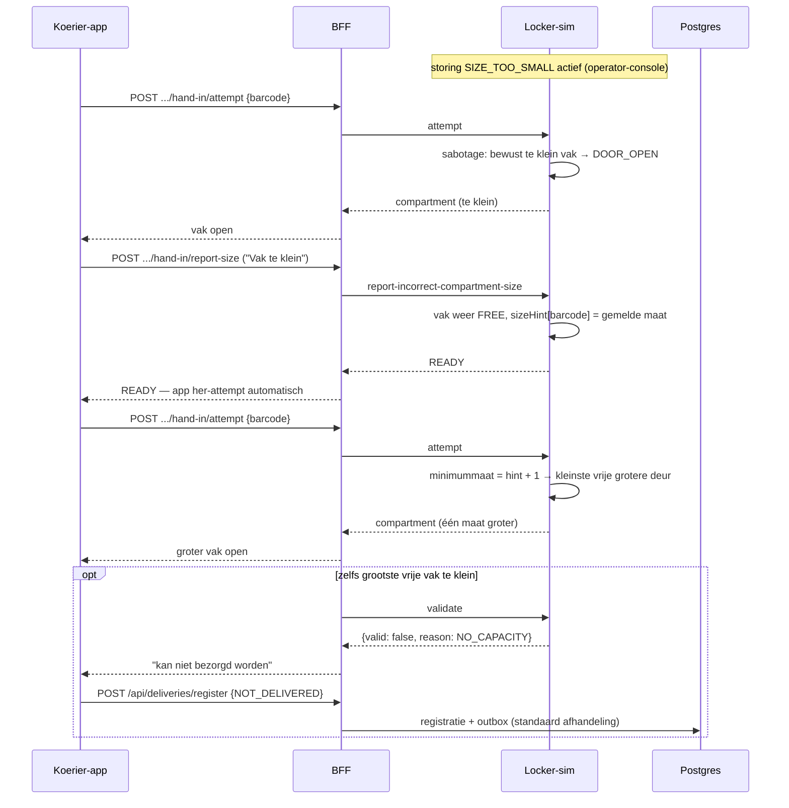
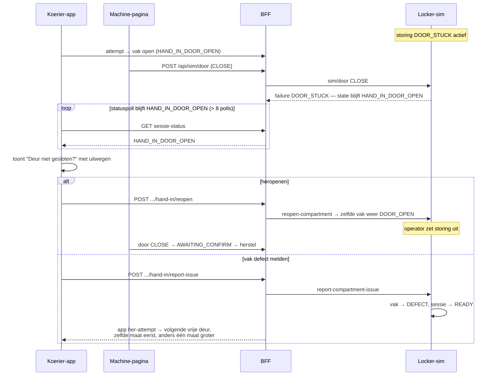
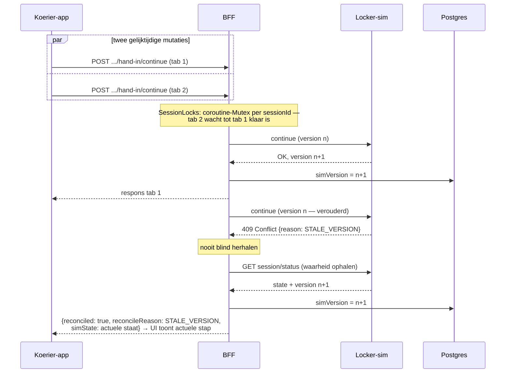
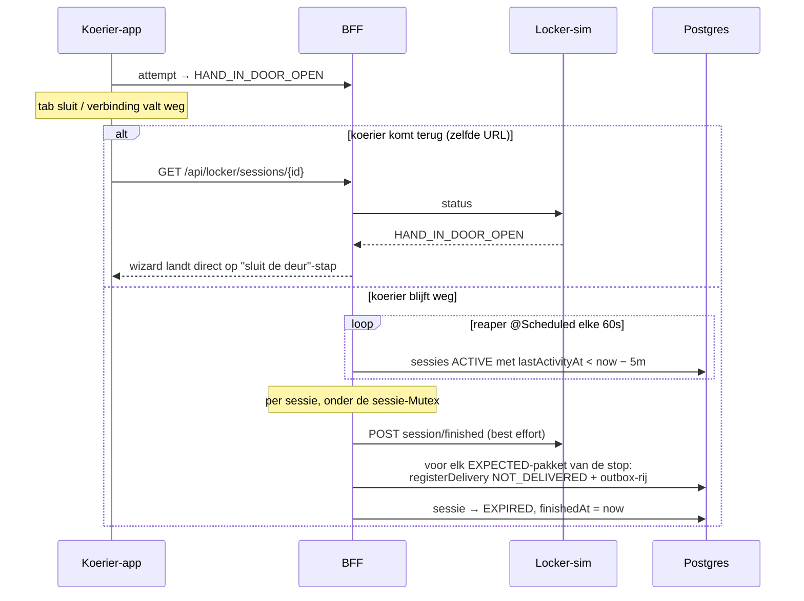
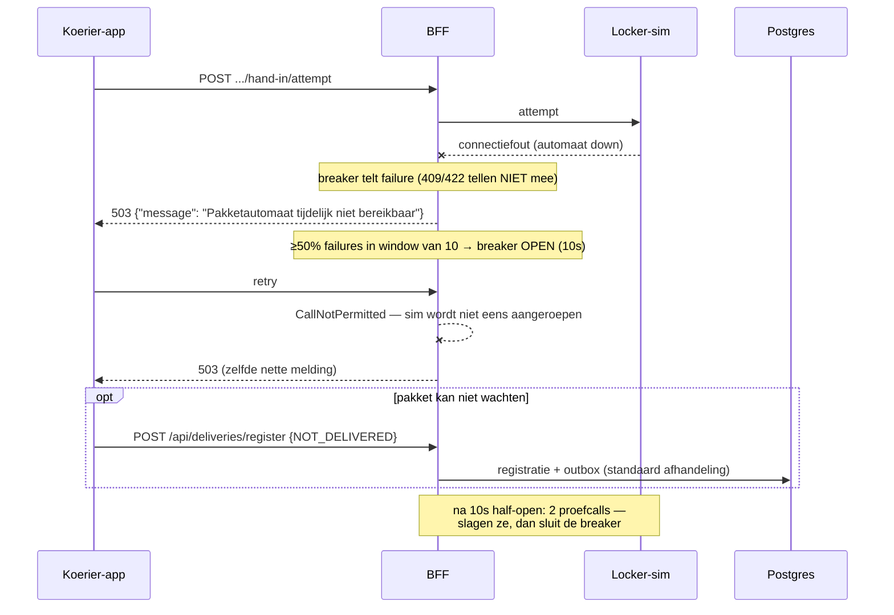
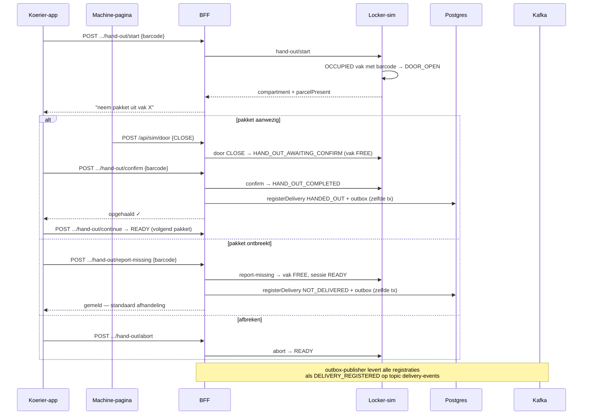

# Architectuur — locker-integratie

Alle diagrammen hieronder zijn gebaseerd op de daadwerkelijke code in deze repo
(controllers, services, security-configuratie en schedulers), niet op de
ideaalplaatjes uit de casetekst. Waar de implementatie bewust afwijkt van de
letterlijke case-API staat dat bij het diagram aangegeven. Renderen naar SVG:
`make diagrams-export` (output in `docs/img/`).

Vaste deelnemers in alle sequencediagrammen: **Koerier-app**, **Machine-pagina**,
**BFF**, **Locker-sim**, **Keycloak**, **Postgres**, **Kafka**.

## 1. Architectuuroverzicht

Drie vertrouwenszones: de browser (alleen courier-realm tokens), het k3s-cluster
(namespace `dhl-demo`) en — daarbinnen — het locker-realm dat uitsluitend
server-side bestaat. De locker-sim heeft bewust géén ingress en géén publieke
hostname: de enige route ernaartoe loopt via de BFF.

## 2. Sessie, QR en koppeling (case-vraag 2)

Hoe start de koerier een lockersessie en hoe wordt hij gekoppeld aan de fysieke
automaat? De BFF initieert de sessie bij de Locker API, bewaart de koppeling in
Postgres en geeft de QR-payload terug; de machine "scant" de QR (webcam op de
machine-pagina) en de statuspoll van de app klapt van NOT_READY naar READY.

## 3. Authenticatie over twee realms (case-vraag 3)

De browser logt éénmalig in via PKCE in het courier-realm; elke `/api`-call
draagt dat bearer-token. Richting de Locker API gebruikt de BFF een eigen
client-credentials-token uit het locker-realm, dat door Spring's
`AuthorizedClientServiceOAuth2AuthorizedClientManager` wordt gecachet en pas
tegen expiratie ververst — het locker-token verlaat de backend nooit.

## 4. Hand-in happy path + outbox → Kafka (case-vragen 1 en 4)

Al het verkeer loopt via de BFF (vraag 1); de eigen backend blijft in sync
doordat de bevestiging in dezelfde transactie een `delivery_registration` én
een outbox-rij schrijft (vraag 4). **Afwijking t.o.v. de case-tekst**: de
voortgang wordt niet via `POST /continue`-polling bewaakt maar via de
1,5s-statuspoll; `continue` betekent hier "volgend pakket".

## 5. Storing: vak te klein (case-vraag 5)

**Afwijking t.o.v. de case-tekst**: er bestaat geen `SIZE_PROPOSAL`-status in
de respons van `attempt` of `continue`. In de implementatie levert de sim met
`SIZE_TOO_SMALL` actief bewust een te klein vak uit; de koerier meldt dat via
`report-incorrect-compartment-size`, waarna de sim de gemelde maat onthoudt en
de eerstvolgende attempt automatisch één maat hoger kiest (S → M → … → XXL).
Past zelfs het grootste vrije vak niet, dan valt het pakket terug op de
standaard niet-bezorgd-afhandeling.

## 6. Storing: deur klemt en heropenen (case-vraag 5)

**Afwijking t.o.v. de case-tekst**: de case formuleert dit als "continue blijft
NOT_READY"; in de implementatie blijft de 1,5s-statuspoll in
`HAND_IN_DOOR_OPEN` hangen en weigert `sim/door CLOSE` met `failure:
DOOR_STUCK` zolang de storing actief is. Na acht polls (±12s) biedt de app de
uitwegen `reopen-compartment` en `report-compartment-issue` aan.

## 7. Storing: 409-conflict en reconciliatie (case-vraag 4)

De Locker API gebruikt optimistic locking: een mutatie met een verouderde
versie levert 409. De BFF serialiseert mutaties per sessie met een in-memory
`Mutex` (bewust eenvoudig — multi-replica zou een Postgres advisory lock of
Redis vragen) en bij een 409 wordt nooit blind opnieuw geprobeerd: de BFF haalt
de actuele staat op en geeft die terug met `reconciled: true`.

## 8. Verbindingsverlies, hervatten en de reaper (case-vraag 5)

Alle voortgang is server-side: de wizard rendert puur op de laatst gepolde
status, dus een gesloten tab die heropent op dezelfde sessie-URL landt vanzelf
op de juiste stap. Verdwijnt de koerier definitief, dan ruimt de reaper
(elke 60s, sessies zonder activiteit > `dhl.reaper.timeout`, default 5m) de
sessie op en registreert hij de resterende pakketten als NOT_DELIVERED.

## 9. Circuit breaker: automaat onbereikbaar (case-vraag 5)

Alle sim-calls lopen door één resilience4j circuit breaker (window 10, drempel
50%, 10s open, 2 half-open proefcalls). 409 en 422 zijn business-signalen en
tellen niet mee; verbindingsfouten en 5xx wel. Bij een open circuit krijgt de
koerier direct een nette Nederlandse 503 en valt het pakket terug op de
standaard niet-bezorgd-afhandeling.

## 10. Hand-out: pakket ophalen (case-vraag 4)

**Afwijking t.o.v. de case-tekst**: de case beschrijft een machine-gedreven
iteratie (`start` laadt alle pakketten, `continue` levert per pakket
`COMPARTMENT_OPENED`/`DENIED`/`FINISHED`). De implementatie is pakket-gedreven:
de koerier kiest een pakket, `start {barcode}` opent precies het vak waar dat
pakket ligt, en `continue` zet de sessie terug op READY voor het volgende.
`report-missing` registreert NOT_DELIVERED via hetzelfde
`DELIVERY_REGISTERED`-outbox-event (een bezorgstatus, geen apart
exception-event — dat is een tweede bewuste vereenvoudiging).

